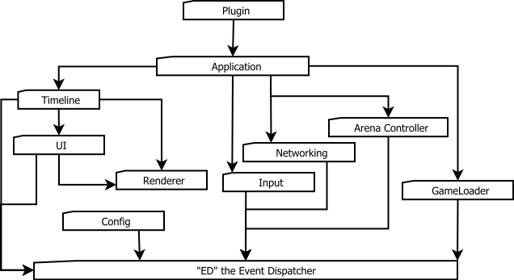

Visualizer Architecture Overview
================================

This document shall serve as a high-level overview of what each component of 
the visualizer architecture shall be responsible for.

Plugin
------
Game-specific functionality is implemented in these.  I don't have anything more to say on that.  It's pretty self-explanatory.

Application
-----------
This is the container for all the components below the application.  It manages game logs to some extent.  The application acts similarly to how plugins will act except that it contains the core features that are common to all plugins.

Timeline
--------
The timeline is responsible for telling what to draw, when and under what state. This is the backbone of the visualizer and will be responsible for presenting information in the most accurate way possible given the desired playback format.

See the :doc:`nomenclature </design/nomenclature>` page for details on the different playback modes.

The initial timeline implementation plans are as follows:

There will be a list of "tracks" which will contain all the objects that are to be drawn to the screen.  Each track object will have a start time and an end time.  Each object will be initialized as taking up a certain percentage of track time and there will be no conflicts with that object::
    
    Each arrow denotes a different animation associated with a track.
    +-------+-------------------------------------------------------+
    |Tracks |                     Timeline                          |
    +-------+-------------------------------------------------------+
     Track A |--->              --->|   >> -->          --->|     ---
     Track B |    -->->>            |     >   ----->        |---->
     Track C |          ->->>-->    |-->            --->    |
             |                      |                       |
     Tags   Turn 1                 Turn 2                  Debug 

The timeline will store a list of tags.  The most common tag will be a 'turn tag' which represents the end of one turn and start of another.  Each animation will specify what objects it "interacts" with.  

If the timeline is in any mode other than 'unit-mode', it will then begin to try to condense areas of the timeline between tags depending on the mode.  A debug tag will denote a universal interaction.  All states must be at the point where they were on the server when the debug tag was inserted.

The timeline exists inside a virtual window inside the UI at the lowest level meaning it only responds to inputs in all the higher-level windows have failed to.

UI
--
The UI contains :doc:`Widgets </design/widgets>` which are objects just like in the Timeline. Widgets contain a set of procedures expected in the UI.  The UI should draw all the objects it contains, and send appropriate inputs to the objects.  Individual objects should contain the logic to handle clicks, hovers, drags (not the queen-style), etc.  If no widget responds to the input, the UI should tell the input system it didn't know what to do.

Renderer
--------
The renderer shall contain a set of procedures that Objects can call to get stuff drawn to the screen.  It will automatically look for resources based on the input texture name if it's not already loaded.  It should also deallocate resources it hasn't been using in a while.

Input
-----
This shall look for input events from the user and send them to the appropriate component.  In the initial implementation, this shall be the UI, then the Timeline, if no UI Widget has responded appropriately.

Inputs that should be sent are: 

* Down-button (For Drags)

* Up-button (left, right, and middle)

* Selections (If no down-button was responded too)

* Key presses

* Voice Commands :|

Networking
----------
This module shall provide the ability to read incoming packet information and append it to the timeline.  Should dispatch 'new_turn' events to be sent to the current plugin.  

Arena Controller
----------------
The arena controller will automatically trigger events for the visualizer in lieu of user input.  This means monitoring the AMQP server for new glogs to display, displaying glogs appropriately, etc. 

ED The Event Dispatcher
-----------------------
Essentially any messages that need to be transmitted across modules will be sent to this.  This removes the need for circular dependencies in some cases.  Loading a gamelog, for example, can happen at the UI level (file->open), command line (python main.py glog_name.glog), or from the arena (beanstalk consuming).  Any of these can dispatch a "load_glog" event while one callback will consume those messages and deal with them.

Game Loader
-----------
This module is responsible for decompressing glogs, acquiring their plugin, and dispatching the decompressed data along with the plugin to be consumed by the application. 

Config Module
-------------
This module will provide a globally accessible place for updating and setting configuration for the visualizer.  It will optionally trigger events on setting changes.

Arena Controller
----------------
The main purpose of this module is to pull games from the AMQP server to display automagically.  
